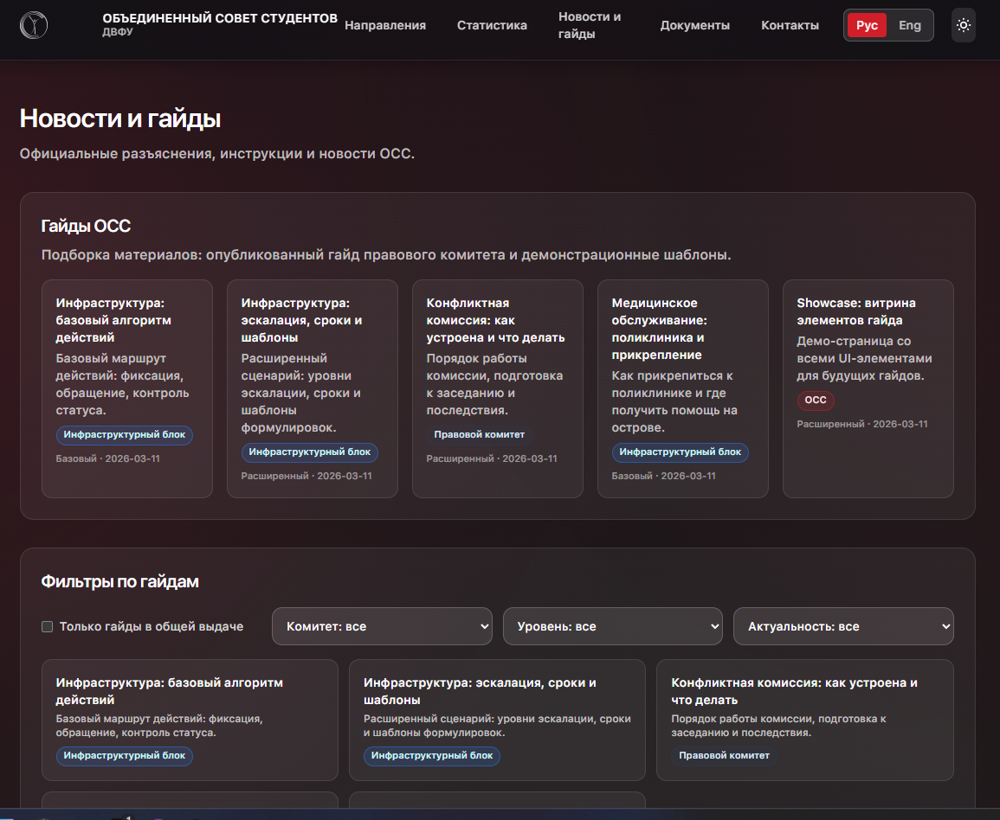

Комиссия по спорам (ДИЗ)
✔️
*Гайд о том, что такое Комиссия по спорам и по каким причинам стоит туда обращаться*

Содержание:
Зачем туда обращаться:
Ошибки в заявлении
Присутствие на Комиссии
Результаты

Комиссия по спорам — это орган, который занимается решением конфликтов между студентом и преподавателями/сотрудниками ДВФУ. Эта комиссия является высшей в вузе и может оспорить даже решение Конфликтной комиссии.

Зачем туда обращаться:
В первую очередь, нужно понять, сделали ли вы всё возможное, чтобы решить спор самостоятельно.

Убедитесь, что вы прошли такую лестницу:
Преподаватель - Куратор - Заместитель РОП`а - Руководитель образовательной программы - Директор департамента - члены Управления по воспитательной работе.

В случае, если ни на одном из этапов проблема не была решена — обращайтесь в Комиссию по спорам. Она решает такие вопросы, как:

Нарушения организации Предметной комиссии (например, студенту было назначенно две повторных комиссии в один день или во второй Предметной комиссии участвовал ведущий преподаватель)

В этом случае, возможно получить дополнительную комиссию, а также студенческого наблюдателя от ОСС

Неявка студента на Предметую комиссию из-за форс-мажора — уважительной причины.

Тогда, назначется дополнительная предметная комиссия

Несогласия с выставленной преподавтелем оценкой/рейтингом, ввиду его предвзятости или иных нарушений

Комиссия по спорам имеет право рекомендовать школе пересмотреть полученные результаты.

Несогласие с вынесенным решением Конфликтной комиссии ДВФУ

Сделать это можно, через Единое окно по ссылке или по пути:

 «Единое окно» -

В нём потребуется подробно описать суть проблемы, тезис и аргументы в вашу сторону. Разберём, как оно должно запоняться:

«Шапка» заявления

Здесь необходимо указать ваше ФИО, специальность\номер группы, а также курс.

Заголовок и позция

В первых двух абзацах распишите по какой дисциплине у вас произошла спорная ситуация, в чём ее суть и чего вы хотите со стороны Комиссии по спорам.

Предмет спора

В этой части — кратко указать (буквально одно предложение) в чем суть спора. Например, нарушение пункта положения о текущем контроле за успеваемостью.

Позиция

Напишите тезис, обоснуйте его нормативными документами, сделайте вывод и сформулируйте просительную часть.

Заключение и приложения

Ставите дату, инициалы и подпись, прикладываете доказательства и связанные с делом документы. Если это коллективное заявление, то приложите лист заявителей.

Заявление может быть коллективным. Такое происходит в случае, если спор произошёл у нескольких людей по одному основанию. Такие заявления куда убедительнее, но и рассматривают их внимательнее остальных

Независимо от сути вопроса, ответ рассматривается в течении месяца.

Ошибки в заявлении
В случае, если заявление было заполненно неверно — его могут отклонить.

Вот основные ошибки:

Нет деталей:

Дата, время, нарушенные внутренние нормативные документы: положение о контроле успеваемости, о рейтинговой системе оценки успеваемости, о комиссии по спорам, и т.д.

Подмена спорной ситуации действиями противоположной стороны:

«Преподаватель поставил мне удовлетворительно», — это не является спорной ситуацией. Объясните суть спора: распишите ситуацию целиком и укажите, как возник конфликт, что стало причиной обращения в комиссию.

Абстрактные обвинения:

Заявитель обвиняет сторону, но не поясняет, в чём это проявляется, например: «Преподаватель оскорбил и предвзято оценил меня» без пояснения предпосылок, сути оскорбления и предвзятости оценки.

Нет просительной части:

Когда заявитель описывает ситуацию и ничего не просит.

Присутствие на Комиссии
Члены комиссии получают по почте пакет документов: заявления, приложения, дату заседания и мнение школы о возникшем споре. При этом комиссия может вызвать студента, преподавателя или замдиректора по ОВР, если их позицию важно заслушать для принятия решения.  

Присутствие на заседании — шанс акцентировать внимание на детали и чётче объяснить свою позицию.  

Комиссия может рассмотреть спор даже через месяц (и несколько) после спорной ситуации. Если вас пригласят, а вы не явитесь без уважительной причины, то спор больше не рассмотрят. Уважительная причина — любое не вызванное вами, но требующее вашего участия событие, которое можно доказать: занятия, сессия, болезнь. Пишите об этом секретарю комиссии: объясните причину неявки и попросите перенести рассмотрение заявления.

Результаты
Есть 3 варианта решения Комиссии по спорам, которые выбираются путем голосования:

Поддержка обращения студента с выполнением его требований

Поддержка члена комиссии по спорам, чьё решение может отличаться от указанного в заявлении.

Отказ в просьбе

Решение передаётся замдиректора по ОВР — в школу или конкретный департамент. Он согласовывает всё с кафедрой: решение исполняется так, потому что комиссия не назначает, а лишь рекомендует принять решение — но фактически все рекомендации комиссии выполняются.

Если школа игнорирует решение — пишите секретарю комиссии, аппарату проректора по учебной работе или проректору и уведомите их о том, что решение не исполняется.

Отметим, что от принятого решения нет последствий ни для школы, ни для преподавателя. Но в исключительных случаях, члены Комиссии могут рекомендовать обратить внимание администрации школы на его действия.

По любым вопросам обращайтесь в Объединенный совет студентов
или в Студенческий офис (8(423)265-24-24 (доб. 2164, 2118)

Материал подготовлен Объединенным советом студентов ДВФУ (2024)
